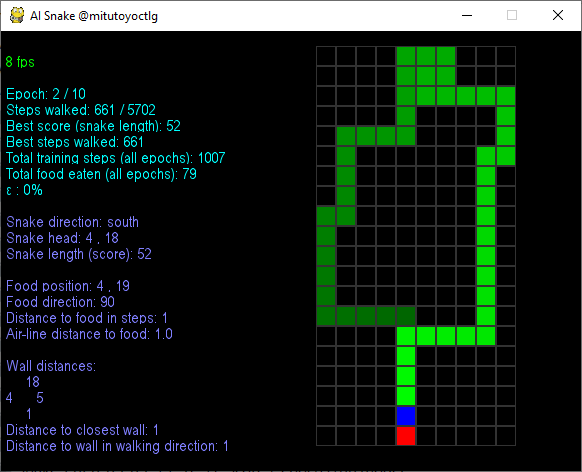

# Snake AI 2021.1
Dieses Projekt dokumentiert die Entwicklung eines Machine Learning Algorithmus im Rahmen einer Berufsorientierung für Gymnasien (BOGY) für das [Leibnitz-Gymnasium in Rottweil](https://lg.rw.schule-bw.de/home/?page_id=11268) im Schuljahr 2020/2021. Als Firmenpartner stand [Mitutoyo CTL in Oberndorf](http://www.mitutoyo-ctl.de/de/karriere/ausbildungundstudium) mit Hardware und Ansprechpartnern zur Verfügung.

Es handelt sich um eine erweiterte Berufsorientierung, d.h. zusätzlich zur üblichen BOGY-Woche stehen noch sechs Nachmittage zur Verfügung, um die Schüler auf das Praktikum vorzubereiten. Aufgrund von CODIV-19 finden diese Nachmittage online statt. Wir danken [Discord](https://discord.com/) für die Nutzungserlaubnis.

## Inspiration

Inspiration für dieses Projekt war das [Leibniz Forschungszentrum](https://lg.rw.schule-bw.de/home/?cat=120) mit einer Idee, die Bewegung von Ameisen vom Computer vorherzusagen. Die Original-Idee beinhaltete ein Terrarium mit echten Ameisen, Kamera usw. Eine solch reale Umgebung birgt jedoch Schwierigkeiten, die mit den Rahmenbedingungen eines Praktikums schlecht vereinbar sind, z.B.:

* wer kümmert sich um die Ameisen? Möglicherweise sterben sie ausgerechnet alle am ersten Tag der Praktikumswoche.
* wie nehmen die Teilnehmer das Ergebnis samt Ameisen mit nach Hause, um es Eltern und Freunden zu zeigen?
* sind die Ergebnisse reproduzierbar? Wir können bei einer fehlerhaften Umsetzung nicht nochmal am gleichen Startpunkt beginnen.
* passt das Projekt in den Zeitrahmen?

Aus diesem Grund haben wir uns entschlossen, zwar ein Machine Learning Projekt durchzuführen, aber die Bedingungen zu unseren Gunsten anzupassen. Entstanden ist ein Snake-Spiel, bei dem der Computer selbst die Spielregeln erlernen soll und dann die richtigen Aktionen durchführt.

# Projekt-Umgebung

## Software

Wir verwenden kostenlose Software: 

* das Betriebssystem [Raspberry Pi OS](https://www.raspberrypi.org/downloads/raspbian/) für den Raspberry Pi 4.  Wir verwenden die Version mit 4 GB Speicher, da wir für ein Experiment viel RAM benötigen.
* [Kitty](http://www.9bis.net/kitty/#!index.md) für den Zugriff auf den Raspberry per SSH
* [Bash](https://www.gnu.org/software/bash/) als Kommandozeile
* [xRDP](http://xrdp.org/) für den Zugriff auf die Benutzeroberfläche des Raspberry
* die Programmiersprache [Python](https://www.python.org/)
* die Entwicklungsumgebung [PyCharm von JetBrains](https://www.jetbrains.com/de-de/pycharm/) (Community Edition)
* die Bibliothek [OpenAI Gym](https://gym.openai.com/)
* die Versionsverwaltung [Git](https://git-scm.com/) mit dem Provider [Github](https://github.com/)
* ggf. unter Windows den [Editor Notepad++](https://notepad-plus-plus.org/) und das Difftool [Winmerge](https://winmerge.org/?lang=de)

## Daten

Im Rahmen des Projekts erzeugen sich die Daten aus dem Spielverlauf selbst.

# Vorbereitung / Einführung

An den sechs vorbereitenden Nachmittagen können Grundlagen vermittelt werden. Dadurch läuft die Praktikumswoche einfach flüssiger und die Schüler erreichen auch echte Ergebnisse.

## Erster Nachmittag, 3.2.2021

Am ersten Nachmittag haben wir uns vorgestellt. Normalerweise führen wir am ersten Tag durch unser Gebäude, um die Räumlichkeiten kennenzulernen. Dies werden wir nachholen, falls wir uns zur Praktikumswoche vor Ort sein können.

Die [Firmenpräsentation](presentation/Firmenpräsentation.pptx) erklärt unser Firmen-Motto, nennt die von uns entwickelte Software, erklärt das duale Studium und zeigt Beispiele von Praktikumsprojekten.

Wir arbeiten mit der [DHBW Stuttgart](https://www.dhbw-stuttgart.de/) zusammen und stellen den Studenten eine [Studentenwohnung](presentation/Studentenwohnung.pptx) zur Verfügung, um die Fahrtzeiten während den Theoriephasen zu verkürzen, so dass sie sich auf das Studium vorbereiten können.

Dann haben wir uns mit dem Thema der Berufsorientierung  auseinandergesetzt. Das Spielprinzip ist vermutlich hinreichend bekannt: es handelt sich um ein Snake-Spiel. Die Schlange (grün) frisst mit  ihrem Kopf (blau) einen Apfel (rot) und wächst dabei.

Zum Glück sind wir hier nicht an fächerübergreifenden Unterricht gebunden, ansonsten  müsste man sich fragen, seit wann Schlangen vegetarisch sind (Biologie), ob nicht Adam und Eva den Apfel gegessen haben, anstatt der Schlange  (Religion) und ob Schlangen mit künstlicher Intelligenz ein Bewusstsein  haben, und somit überhaupt in Tierversuchen einsetzbar sind (Ethik).

Die von uns bereitgestellte Spieleumgebung ist bereits auf  KI-Experimente vorbereitet, d.h. ein beliebiger Algorithmus kann in der  Umgebung mehrere Spiele nacheinander ohne menschliches Zutun spielen.  Zur Spieleumgebung gibt es eine Visualisierung, die folgendermaßen  aufgebaut ist:

- der linke Bereich liefert statistische Daten
  - grün: Daten zur Visualisierung, derzeit nur die aktuelle  Visualisierungsgeschwindigkeit in Bildern pro Sekunde (fps; frames per  second)
  - hellblau: Daten zum Training, d.h. mehrere Spiele übergreifend
  - violett: Daten zum aktuell laufenden Spiel. Ein Teil dieser Daten könnte als Input für Neuronen dienen.
- der rechte Bereich visualisiert das Spielfeld
  - rot: das Futter (angeblich ein Apfel)
  - blau: der Kopf der Schlange
  - grün: Körper der Schlange, wobei die hellere Teile früher verschwinden als dunklere Teile

Im Bild sieht man einen von Mitutoyo programmierten Algorithmus, der  noch keine künstliche Intelligenz nutzt. Dabei handelt es sich bewusst  um einen Algorithmus, der nicht mathematisch als perfekt bewiesen ist.  Unsere KI wird sich mit diesem Algorithmus messen müssen. Bei 1000  Spielen erreicht er eine Länge von bis zu 80 Kästchen, was einer  Abdeckung von 40% der Fläche entspricht.

Die Hardware, ein [Raspberry Pi 4](presentation/Raspberry%20Hardware.pptx), haben wir uns zunächst nur auf Bildern angeschaut. Die echte Hardware ist bereits verschickt, wird aber erst im Laufe der Woche eintreffen. Dank der Speichererweiterung auf 4 GB können auch größere Datenmengen verarbeitet werden, wie sie bei Machine Learning auftreten.

Um auf den Raspberry zugreifen zu können, wenn er zugestellt wurde, haben wir SSH grob erklärt und [Kitty](http://www.9bis.net/kitty/#!index.md) installiert.

Um für eine spätere Zusammenarbeit vorbereitet zu sein, haben wir Accounts bei [Github](https://github.com/) angelegt und Zugriff auf dieses Repository gewährt.