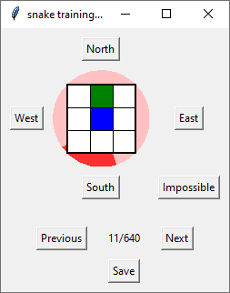
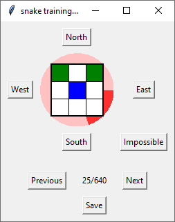
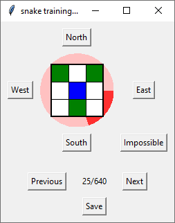

# Snake AI 2021.1
Dieses Projekt dokumentiert die Entwicklung eines Machine Learning Algorithmus im Rahmen einer Berufsorientierung für Gymnasien (BOGY) für das [Leibnitz-Gymnasium in Rottweil](https://lg.rw.schule-bw.de/home/?page_id=11268) im Schuljahr 2020/2021. Als Firmenpartner stand [Mitutoyo CTL in Oberndorf](http://www.mitutoyo-ctl.de/de/karriere/ausbildungundstudium) mit Hardware und Ansprechpartnern zur Verfügung.

Es handelt sich um eine erweiterte Berufsorientierung, d.h. zusätzlich zur üblichen BOGY-Woche stehen noch sechs Nachmittage zur Verfügung, um die Schüler auf das Praktikum vorzubereiten. Aufgrund von CODIV-19 finden diese Nachmittage online statt. Wir danken [Discord](https://discord.com/) für die Nutzungserlaubnis.

## Inspiration

Inspiration für dieses Projekt war das [Leibniz Forschungszentrum](https://lg.rw.schule-bw.de/home/?cat=120) mit einer Idee, die Bewegung von Ameisen vom Computer vorherzusagen. Die Original-Idee beinhaltete ein Terrarium mit echten Ameisen, Kamera usw. Eine solch reale Umgebung birgt jedoch Schwierigkeiten, die mit den Rahmenbedingungen eines Praktikums schlecht vereinbar sind, z.B.:

* wer kümmert sich um die Ameisen? Möglicherweise sterben sie ausgerechnet alle am ersten Tag der Praktikumswoche.
* wie nehmen die Teilnehmer das Ergebnis samt Ameisen mit nach Hause, um es Eltern und Freunden zu zeigen?
* sind die Ergebnisse reproduzierbar? Wir können bei einer fehlerhaften Umsetzung nicht nochmal am gleichen Startpunkt beginnen.
* passt das Projekt in den Zeitrahmen?

Aus diesem Grund haben wir uns entschlossen, zwar ein Machine Learning Projekt durchzuführen, aber die Bedingungen zu unseren Gunsten anzupassen. Entstanden ist ein Snake-Spiel, bei dem der Computer selbst die Spielregeln erlernen soll und dann die richtigen Aktionen durchführt.

# Projekt-Umgebung

## Software

Wir verwenden kostenlose Software: 

* das Betriebssystem [Raspberry Pi OS](https://www.raspberrypi.org/downloads/raspbian/) für den Raspberry Pi 4.  Wir verwenden die Version mit 4 GB Speicher, da wir für ein Experiment viel RAM benötigen.
* [Kitty](http://www.9bis.net/kitty/#!index.md) für den Zugriff auf den Raspberry per SSH
* [Bash](https://www.gnu.org/software/bash/) als Kommandozeile
* [xRDP](http://xrdp.org/) für den Zugriff auf die Benutzeroberfläche des Raspberry
* die Programmiersprache [Python](https://www.python.org/)
* die Entwicklungsumgebung [PyCharm von JetBrains](https://www.jetbrains.com/de-de/pycharm/) (Community Edition)
* die Bibliothek [OpenAI Gym](https://gym.openai.com/)
* die Versionsverwaltung [Git](https://git-scm.com/) mit dem Provider [Github](https://github.com/)
* ggf. unter Windows den [Editor Notepad++](https://notepad-plus-plus.org/) und das Difftool [Winmerge](https://winmerge.org/?lang=de)

## Daten

Im Rahmen des Projekts erzeugen sich die Daten aus dem Spielverlauf selbst.

# Vorbereitung / Einführung

An den sechs vorbereitenden Nachmittagen können Grundlagen vermittelt werden. Dadurch läuft die Praktikumswoche einfach flüssiger und die Schüler erreichen auch echte Ergebnisse.

## Erster Nachmittag, 3.2.2021

Am ersten Nachmittag haben wir uns vorgestellt. Normalerweise führen wir am ersten Tag durch unser Gebäude, um die Räumlichkeiten kennenzulernen. Dies werden wir nachholen, falls wir uns zur Praktikumswoche vor Ort sein können.

Die [Firmenpräsentation](presentation/Firmenpräsentation.pptx) erklärt unser Firmen-Motto, nennt die von uns entwickelte Software, erklärt das duale Studium und zeigt Beispiele von Praktikumsprojekten.

Wir arbeiten mit der [DHBW Stuttgart](https://www.dhbw-stuttgart.de/) zusammen und stellen den Studenten eine [Studentenwohnung](presentation/Studentenwohnung.pptx) zur Verfügung, um die Fahrtzeiten während den Theoriephasen zu verkürzen, so dass sie sich auf das Studium vorbereiten können.

Dann haben wir uns mit dem Thema der Berufsorientierung  auseinandergesetzt. Das Spielprinzip ist vermutlich hinreichend bekannt: es handelt sich um ein Snake-Spiel. Die Schlange (grün) frisst mit  ihrem Kopf (blau) einen Apfel (rot) und wächst dabei.

Zum Glück sind wir hier nicht an fächerübergreifenden Unterricht gebunden, ansonsten  müsste man sich fragen, seit wann Schlangen vegetarisch sind (Biologie), ob nicht Adam und Eva den Apfel gegessen haben, anstatt der Schlange  (Religion) und ob Schlangen mit künstlicher Intelligenz ein Bewusstsein  haben, und somit überhaupt in Tierversuchen einsetzbar sind (Ethik).

Die von uns bereitgestellte Spieleumgebung ist bereits auf  KI-Experimente vorbereitet, d.h. ein beliebiger Algorithmus kann in der  Umgebung mehrere Spiele nacheinander ohne menschliches Zutun spielen.  Zur Spieleumgebung gibt es eine Visualisierung, die folgendermaßen  aufgebaut ist:

- der linke Bereich liefert statistische Daten
  - grün: Daten zur Visualisierung, derzeit nur die aktuelle  Visualisierungsgeschwindigkeit in Bildern pro Sekunde (fps; frames per  second)
  - hellblau: Daten zum Training, d.h. mehrere Spiele übergreifend
  - violett: Daten zum aktuell laufenden Spiel. Ein Teil dieser Daten könnte als Input für Neuronen dienen.
- der rechte Bereich visualisiert das Spielfeld
  - rot: das Futter (angeblich ein Apfel)
  - blau: der Kopf der Schlange
  - grün: Körper der Schlange, wobei die hellere Teile früher verschwinden als dunklere Teile

Im Bild sieht man einen von Mitutoyo programmierten Algorithmus, der  noch keine künstliche Intelligenz nutzt. Dabei handelt es sich bewusst  um einen Algorithmus, der nicht mathematisch als perfekt bewiesen ist.  Unsere KI wird sich mit diesem Algorithmus messen müssen. Bei 1000  Spielen erreicht er eine Länge von bis zu 80 Kästchen, was einer  Abdeckung von 40% der Fläche entspricht.


Die Hardware, ein [Raspberry Pi 4](presentation/Raspberry%20Hardware.pptx), haben wir uns zunächst nur auf Bildern angeschaut. Die echte Hardware ist bereits verschickt, wird aber erst im Laufe der Woche eintreffen. Dank der Speichererweiterung auf 4 GB können auch größere Datenmengen verarbeitet werden, wie sie bei Machine Learning auftreten.

Um auf den Raspberry zugreifen zu können, wenn er zugestellt wurde, haben wir SSH grob erklärt und [Kitty](http://www.9bis.net/kitty/#!pages/download.md) installiert.

Um für eine spätere Zusammenarbeit vorbereitet zu sein, haben wir Accounts bei [Github](https://github.com/) angelegt und Zugriff auf dieses Repository gewährt.

## Zweiter Nachmittag, 10.2.2021

### Raspberry Pis anschließen und finden

Ein Raspberry Pi kam bereits im Laufe der letzten Woche an. Nach dem Anschluss im LAN gab es zunächst Schwierigkeiten, diesen aufzufinden. Selbst der [Advanced IP Scanner](https://www.advanced-ip-scanner.com/de/) half nicht. 

Beim Einsatz solcher Tools ist eine Aufklärung über [§202c StGB](https://www.gesetze-im-internet.de/stgb/__202c.html) angebracht, auch bekannt als "Hackerparagraph". Für private Zwecke im eigenen Netzwerk sind solche Tools zulässig. In fremden Netzwerken, z.B. dem Schulnetz, könnte die Ausführung als Vorbereitung des Ausspähens von Daten gewertet werden und damit strafbar sein. 

Wo wir gerade beim Thema Recht sind: "Unwissenheit schützt vor Strafe nicht" sagt man. Das ergibt sich aus [§17 StGB](https://www.gesetze-im-internet.de/stgb/__17.html). Dort heißt es "*[...] handelt er ohne Schuld, wenn er diesen Irrtum nicht vermeiden konnte*". Allerdings lassen sich durch das Lesen von Gesetzen Irrtümer vermeiden, so dass man wahrscheinlich schlechte Karten hat.

Letztlich konnte der Raspberry Pi dann doch noch gefunden werden. Grund war, dass der Raspberry lediglich eine IPv6 Adresse und keine IPv4 Adresse bekommen hatte. Damit haben wir nicht gerechnet, sonst hätten wir den Raspberry so konfiguriert, dass er nur IPv4 Adressen akzeptiert.

Allerdings war der Raspberry Pi über seinen Namen ansprechbar, so dass die Suche nach der IPv6-Adresse gar nicht erforderlich war. Wir haben Euch den Raspberry mit seinem Standard-Namen `raspberry` zugeschickt. Unter "Host Name (or IP address)" trägt man daher `raspberry` ein.


Die Nutzung von Kitty ist [in manchen Ländern](http://www.cryptolaw.org/cls-sum.htm) übrigens auch reglementiert, da es Verschlüsselung beinhaltet. In Deutschland ist es jedoch unproblematisch.

Sobald die Verbindung vom Computer mittels Kitty zum Raspberry hergestellt ist, haben wir einen wichtigen Schritt erreicht: wir haben jetzt Zugriff auf einen Linux-Computer mit Hilfe der Bash. Beides erklären wir am heutigen Nachmittag.

### Linux

Linux ist ein Betriebssystem für Computer, also eine Alternative für Windows. Die [Linux-Präsentation](presentation/Linux.pptx) geht auf einige Unterschiede ein. Die Folien sind eher theoretischer Natur, weswegen wir viele Folien ausgeblendet haben. Wer mehr Interesse am Dateisystem hat, kann sich gern die versteckten Folien ansehen.

Wer sich langfristig mit dem Thema Software-Entwicklung auseinandersetzen möchte, kommt unserer Meinung nach nicht um Linux herum.

### Bash

Die Bash ist eine Kommandozeile von Linux. Sie ähnelt der Eingabeaufforderung von Windows, ist jedoch wesentlich mächtiger. Die [Bash-Präsentation](presentation/Bash.pptx) ist weniger theoretisch und enthält viele praktische Übungen.

## Dritter Nachmittag, 24.2.2021

### Remote Desktop

Nachdem wir am letzten Nachmittag eine Verbindung per SSH zur Bash aufgebaut hatten, haben wir heute eine Verbindung zur grafischen Oberfläche mittels Remote Desktop verwendet. 


Dies hat leider nicht auf Anhieb bei allen Systemen geklappt, so dass wir Fehlersuche betreiben mussten. Ursache war in diesem Fall, dass der Raspberry per LAN und der PC per WLAN angebunden waren, diese beiden Netze jedoch vom Router aus Sicherheitsgründen separiert wurden, so dass ein gegenseitiger Zugriff nicht möglich war.

Ein Zugriff per Remote Desktop ist bei Raspberry Pi OS nicht automatisch möglich. Damit es klappt, musste vorher auf der Shell der entsprechende Dienst installiert werden mit `sudo apt install xrpd`. Dies bestätigt wieder einmal, wie wichtig die Shell (in unserem Fall die Bash) bei Linux ist.

### PyCharm

Pycharm hatten wir bereits für Euch heruntergeladen und abgelegt. Wir haben dann gemeinsam PyCharm installiert und uns [einen ersten Überblick](presentation/Pycharm.pptx) verschafft.

Danach haben wir es auch [für Windows heruntergeladen](https://www.jetbrains.com/de-de/pycharm/download/#section=windows) und ebenfalls installiert, so dass ihr es auch mal ohne Raspberry benutzen könnt.

### Python

Wir haben dann eine [Einführung in Python](presentation/Python%20Einführung.pptx) durchgearbeitet, die viele Möglichkeiten für eigenes Ausprobieren bot. Wir sind bis Folie 31 gekommen und machen da nächste Woche weiter.

### Hausaufgaben

Bei Interesse könnt ihr ein paar Aufgaben von [Project Euler](https://projecteuler.net/archives) lösen.

## Vierter Nachmittag, 3.3.2021

Wir haben die [Einführung in Python](presentation/Python%20Einführung.pptx) durchgearbeitet.

## Fünfter Nachmittag, 10.3.2021

Wir haben uns das Programmierparadigma [Objektorientierung](presentation/Python%20Objektorientierung.pptx) angeschaut, inklusive Übungen zur Umsetzung in Python.

## Sechster Nachmittag, 17.3.2021

Bei umfangreichen Softwareprojekten ist es nicht mehr möglich, allein an einem Programm zu arbeiten, da es sonst nicht oder nicht schnell genug fertig wird. Daher arbeiten mehrere Programmierer in einem Team zusammen. Dann wiederum muss jeder Programmierer Zugriff auf den Code seiner Teammitglieder haben. Dieses Aufgabe (und noch ein paar mehr) löst ein Versionskontrollsystem.

Wir haben den Nutzen von [Versionskontrolle allgemein](presentation/Versionskontrolle.pptx) allgemein erklärt. Danach sind wir die [Grundlagen von Git](presentation/Git%20Grundlagen.pptx) erklärt, einem von mehreren kostenlosen Versionsverwaltungssystemen.

# BOGY Woche

## Montag, 22.3.2021, Vormittag
### Repository klonen

Wir haben die Datenbank von Github auf den Raspberry geklont mit

`git clone https://github.com/BogyMitutoyoCTL/Snake-AI-2021.1.git snake`

Beim Ausprobieren ist uns aufgefallen, dass für NumPy und Python noch zwei Bibliotheken fehlen. Diese beiden Bibliotheken konnten wir mit folgenden Befehlen nachinstallieren:

```bash
sudo apt-get install libatlas-base-dev
sudo apt install libsdl2-ttf-2.0-0
```

### Erläuterung des bestehenden Codes

Da wir uns auf das Machine Learning konzentrieren wollen, hat Mitutoyo das Snake-Spiel bereits implementiert. Über diese Implementierung haben wir uns einen Überblick verschafft.

#### Snake

Der Kern des Programms, das Spiel, ist in der Klasse `Snake` untergebracht. Das Spiel akzeptiert 7 mögliche Bewegungen:

* `north`, um nach oben zu laufen
* `east`, um nach rechts zu laufen
* `south`, um nach unten zu laufen
* `west`, um nach links zu laufen
* `turn left`, um in Laufrichtung der Schlange links abzubiegen
* `turn right`, um in Laufrichtung der Schlange rechts abzubiegen
* `straight`, um weiter geradeaus in Laufrichtung der Schlange zu laufen

Die Klasse `Snake` nutzt eine andere Klasse `Field`, um sich zu zeichnen. Dabei handelt es sich um ein zweidimensionales Array, das wir als Spielfeld bezeichnen. `Field` enthält bereits die Farben, wie sie später abgebildet werden sollen.

Normalerweise würde das Snake Spiel von einem Menschen mit einem Controller bedient. Das ist in unserem Fall unpraktisch. Daher gibt es um die Klasse `Snake` herum noch ein sogenanntes Gym (englisch *gymnasium* = Sporthalle), also einen Ort, in der die künstliche Intelligenz trainieren kann. Dieses Gym ist kompatibel zu der Definition eines Gym von OpenAI. Die Klasse dafür bei uns heißt `SnakeGym`.

#### Algorithmen

Damit beim Programmieren von unterschiedlichen Strategien der Schlange weder das Gym, noch das Spiel selbst geändert werden muss, haben wir eine Klasse `Algorithm` definiert. Diese Klasse ist vorbereitet auf Machine Learning, d.h. sie hat Methoden und Eigenschaften, die wir am Anfang noch nicht brauchen, sondern erst, wenn wir tatsächlich Machine Learning mit neuronalen Netzen betreiben. Mit dieser Klasse `Algorithm` ist es sehr einfach, selbst eine Idee zu verwirklichen, wie die Schlange sich bewegen soll.

Ein Beispiel für einen solchen Algorithmus ist `RotateForever`. Dieser Algorithmus basiert auf der Idee, dass Snake möglichst lang gespielt werden soll. Die einfachste Art, ewig zu spielen ist, sich immer im Kreis zu drehen. Leider bekommt man dafür keine Punkte. Die Implementierung dieser Idee ist beinahe trivial:

```python
from Algorithms.Algorithms import Algorithm
from GameData import GameData


class RotateForever(Algorithm):
    def __init__(self):
        super().__init__()

    def decide(self, info: GameData) -> str:
        return "turn left"
```

Die ersten Zeilen sind immer identisch. Lediglich die Funktion `decide()` muss angepasst werden.

Von diesen sehr einfachen Algorithmen haben wir einige zusammengestellt:

* `RotateForever`: dreht sich immer im Kreis
* `RandomChoice`: wählt eine Zufallsaktion, also ob man einfach blind auf dem Controller herumdrückt

#### Entscheidungsgrundlagen für Algorithmen

Das Spielfeld ist folgendermaßen aufgebaut:

​    

Diese Richtung der Achsen ist in der Bildverarbeitung üblich. Euer Monitor hat z.B. ebenfalls die Ecke P(0|0) oben links und Q(1920|1080) unten rechts.

Damit man sich nicht blind für eine Aktion entscheiden muss, bekommt man für die Entscheidung ein paar Grundlagen, und zwar im Parameter `info` vom Typ `GameData`. Darin sind allerhand Informationen zu finden, die man für Entscheidungen braucht:

* `head_x` bzw. `head_y`: wo der Kopf der Schlange sich befindet. Das Ergebnis ist eine Zahl, entsprechend der Koordinate.
* `snake_length`: Länge der Schlange
* `direction`: Aktuelle Laufrichtung der Schlange. Das Ergebnis ist ein String mit den Werten `"north"`, `"east"`, `"south"` oder `"west"`.
* `food_x` bzw. `food_y`: wo sich das Futter befindet. Das Ergebnis ist eine Zahl, entsprechend der Koordinate.
* `food_direction`: Richtung, in der sich das Futter befindet. Die Winkel sind dabei wie folgt:
  
* `food_distance_in_steps`: Schritte bis zum Futter (kürzester Weg, ohne Berücksichtigung von Hindernissen)
* `air_line_distance`: Abstand zum Futter in Kästchen (diagonal, Pythagoras)
* `walldistance_`...: Abstand zur Wand (vom Kopf aus)
* u.a.

Ebenfalls nützlich sind einige Funktionen:

* `can_move_to(x,y)`: findet heraus, ob an diese Position gelaufen werden kann, ohne zu sterben. Für X und Y setzt man dabei am besten eine Koordinate ein, die sich in der Nähe des Kopfes befindet, also, z.B.

```python
if info.can_move_to(info.head_x - 1, info.head_y):  # Ist links vom Kopf Platz?
      return "west"                                     # Dann kann man nach Westen fahren
```

* `body_age(x,y)`: findet heraus, wie bald sich der Körper an dieser Stelle hier wegbewegt

* `is_body(x,y)`, `is_food(x,y)` und `is_head(x,y)`: um abzufragen, um welche Sorte Kästchen es sich handelt


#### Die Anzeige

Damit wir eine hübsche Anzeige mit allerhand Statistik bekommen, gibt es die Klasse `Visualization`. Diese nutzt die Bibliothek PyGame, um ein Fenster zu zeigen.

Die Daten der Statistik kommen aus der Klasse `TrainingData`.

#### Zum lauffähigen Programm zusammengestellt

Das Programm `main.py` fügt alle Dinge zusammen: 

* es baut das Gym auf
* es zeigt alle Algorithmen an und lässt den Benutzer einen auswählen
* es lässt den Algorithmus in einigen Runden (`max_epochs`) spielen
* zeigt am Ende die Statistik auf der Konsole an.

Auch das Programm `main.py` ist schon auf Machine Learning vorbereitet. Deshalb gibt es dort auch schon ein Belohnungssystem vom Typ `RewardSystem` und einen Algorithmus für Zufallsentscheidungen, aus denen die KI später lernen wird.

Die Klassen `Snake`, `Field`,`SnakeGym`, `Algorithm`, `RotateForever`, `RandomChoice` und `GameData` müssen im Laufe des Praktikums nicht geändert werden.

### Aufgabe: schreibe einen Algorithmus

Die Aufgabe für diesen Vormittag ist, einen eigenen Algorithmus zu schreiben, der hoffentlich schon besser funktioniert als der Algorithmus, der per Zufall entscheidet. Dazu verwenden wir noch keine KI. Wir möchten zunächst herausfinden, wie schwierig es eigentlich ist, gut Snake zu spielen.

Das Grundgerüst sieht so aus:

```python
from Algorithms.Algorithms import Algorithm
from GameData import GameData


class B⸻(Algorithm):  # Passe den Klassen-Namen hier an
    def __init__(self):
        super().__init__()

    def decide(self, info: GameData) -> str:
        # Programmiere hier
```

## Montag, 22.3.2021, Nachmittag

### Hamiltonweg

Wir haben uns eine einfache aber perfekte Lösung für das Snake-Spiel ausgedacht: im Zickzack das Feld nach Futter absuchen, so dass man am Ende wieder am Anfang ankommt. 


Diese Art der Lösung ist ein Hamiltonweg. Dazu gibt es bei [Wikipedia](https://de.wikipedia.org/wiki/Hamiltonkreisproblem) noch ein paar Hinweise. In unserer Spielumgebung funktioniert ein Hamiltonweg nur bedingt, da die Schlange nach 117 Schritten verhungert. Ihr bleibt also gar nicht genug Zeit, alle Kästchen nach Futter abzusuchen.

Um den definierten Anfangspunkt O(0|0) zu erreichen kann man folgenden Code verwenden:

```python
class ZickZack(Algorithm):
    def __init__(self):
        super().__init__()
        self.fahre = ["north"] * 10 + ["west"] * 5

    def decide(self, info: GameData) -> str:
        # Fahre zu Beginn einer Runde nach oben links
        if len(self.fahre) > 0:
            action = self.fahre[0]
            del self.fahre[0]
            return action
        # Fahre im Zickzack nach unten
        else:
            ...
```

### Aufgabe: vervollständige den Weg

Vervollständige den obigen Code an der Stelle `...`, so dass die Schlange im Zickzack nach unten fährt und auf der rechten Seite ein Kästchen übrig lässt, um wieder nach oben zu kommen.

### Github Token für den Zugriff einrichten

Damit der Zugriff auf Github einfacher wird und wir uns nicht ständig einloggen müssen, richten wir uns ein Github Token ein. Das geht folgendermaßen:

1. Logge Dich auf Github ein und gehe zu den Einstellungen Deines Profils.

   

2. Gehe zu *Developer Settings* und dann *Personal Access Tokens*
3. Klicke auf *Generate New Token*
4. Gib dem Token einen Namen als Bedeutung, z.B. "Snake bei Mitutoyo".
5. Setze ein Häkchen bei: **repo**, **read:org** und **gist**.
6. Klicke auf *Generate Token*
7. Klicke auf das Icon, um die Zahlenfolge in die Zwischenablage zu kopieren
8. In PyCharm: gehe zu *File* / *Settings*
9. Gehe zu *Version Control* / *GitHub*
10. Klicke auf `+` und wähle "Login with Token..."
11. Füge die Zahlenfolge in das Feld ein.

## Dienstag, 23.3.2021, Vormittag

Am Vormittag haben wir uns ganz allgemein mit [Künstlicher Intelligenz](presentation/Künstliche%20Intelligenz.pptx) befasst.

## Dienstag, 23.3.2021, Nachmittag

Wir haben gemeinsam verglichen, was die Ergebnisse unserer eigenen Algorithmen sind.

* I⸻: bestes Ergebnis 29 in 100 Spielen, max. Schritte 558, Gesamtmenge Futter: 1212, Gesamt-Schritte: 20433, Anzahl der `if`-Anweisungen: 9
  
* J⸻: bestes Ergebnis 27 in 100 Spielen, max. Schritte 298, Gesamtmenge Futter: 802, Gesamt-Schritte: 8442, Anzahl der `if`-Anweisungen: 4

* J⸻: bestes Ergebnis 32 in 100 Spielen, max. Schritte 324, Gesamtmenge Futter: 1156, Gesamt-Schritte: 12116, Anzahl der `if`-Anweisungen: 8

* T⸻: bestes Ergebnis 51 in 100 Spielen, max. Schritte 709, Gesamtmenge Futter: 2419, Gesamt-Schritte: 28963, Anzahl der `if`-Anweisungen: 20

Grob kann man erkennen, dass das Ergebnis besser wird, je mehr Bedingungen oder Situationen im Algorithmus berücksichtigt werden. Das drückt sich häufig durch die Anzahl der `if`/`elif` Abfragen aus.

### Spaghetti-Code?

Gleichzeitig merkt man beim Programmieren aber auch, dass es immer schwieriger wird, die richtige Stelle zu finden, an der man noch weiter verbessern kann. Bei Programmierern mit wenig Erfahrung kann das schnell zu so genanntem Spaghetti Code führen. Als Spaghetti Code wird Quellcode bezeichnet, der in sich verstrickt ist. 

Bei Spaghetti Code ist oft nicht klar, was alles passiert, wenn man an einer Stelle etwas ändert. Und man muss sich fragen, ob man selbst das Programm noch verstehen würde, wenn man es in einem halben Jahr noch einmal liest.

Damit das nicht passiert, haben sich ein paar Regeln und Konzepte gebildet. Einerseits gibt es so genannte Entwurfsmuster (engl. *patterns*), mit denen man bestimmte Probleme lösen kann, zum anderen gibt es eine Initiative namens *Clean Code*, die zumindest Hinweise gibt, was man tun bzw. nicht tun sollte. Und wenn man dann nicht weiter weiß, sollte man einen Entwickler fragen, der mehr Erfahrung hat und vielleicht einen gute Tipp auf Lager hat, wie der Spaghetti Code ordentlicher aussehen könnte.

Die Präsentation [Von der Spaghetti-Schlange zu Q-Tables](presentation/Von%20der%20Spaghetti-Schlange%20zu%20Q-Tables.pptx) stellt die Problematik vor und schlägt eine Lösung vor.

### Aufgabe: Umrechnung einer Situation in eine Nummer

Die Aufgabe ist bereits in der Präsentation beschrieben: schreibe eine Funktion, die 

* einen Ausschnitt aus dem Spielfeld um den Kopf herum in Betracht zieht
* die Situation aus leeren und belegten Feldern in eine Zahl umrechnet
* und dabei bestimmte Felder ausmaskieren (auslassen) kann

Ausgangspunkt für die Implementierung ist folgende Klasse:

```python
from Algorithms.Algorithms import Algorithm
from GameData import GameData


class QTable⸻(Algorithm):  # Passe den Klassen-Namen hier an
    def __init__(self):
        super().__init__()

    def decide(self, info: GameData) -> str:
        situationsnummer = self.umrechnen(info, 3, "111 101 111")
        return "north"

    def umrechnen(self, info, kantenlaenge, maske):
        # hier rechnen
        return situationsnummer
```

## Mittwoch, 24.3.2021, Vormittag

### Aufgabe: Entscheidungen sammeln

Wir haben ein Programm geschrieben, das Entscheidungen für bestimmte Situationen aufzeichnen und abspeichern kann. Dieses Programm ist kompatibel zu der Art und Weise, wie wir die Situation in eine Nummer umrechnen. Allerdings gilt es nun, 2⁸ Felder * 5 Richtungen, also für 1280 Fälle die Entscheidungen einzusammeln. Diese Arbeit teilen wir uns. 

Bei einem 5x5 Ausschnitt und 5 Richtungen hätten wir schon 83 Millionen Entscheidungen zu treffen. Die wollen wir selbst mit einem Programm nicht durchgehen - das soll der Computer dann lieber selbst lernen.

Die grafische Oberfläche zum Einsammeln von Entscheidungen sieht folgendermaßen aus:

 

Zu sehen ist ein 3x3 Ausschnitt aus dem Spielfeld. Der dunkelrote Winkel zeigt an, in welcher Richtung sich das Futter befindet. In diesem Fall liegt das Futter auf jeden Fall südlich, es könnte aber zusätzlich noch ein bisschen östlich liegen, vielleicht aber auch westlich. Dass der rote Ausschnitt eher nach Westen zeigt, ist dabei kein Anzeichen für eine höhere Wahrscheinlichkeit, dass das Futter im Westen liegt.

Welche Aktion die Schlange in dieser Situation auslösen soll, bestimmst Du. Folgende Kriterien sind zu beachten:

* Die Schlange soll keinesfalls sterben. Fahre also nicht in den Schwanz der Schlange.
* Die Schlange sollte möglichst schnell zum Futter kommen.

Da der rote Bereich sowohl westlich als auch östlich liegt, ist weder Osten noch Westen im gezeigten Fall eine gute Wahl. Wenn die Schlange allerdings nach Süden fährt, wird irgendwann die Ausprägung zwischen Ost oder West deutlicher:

* Verschiebung nach Osten, falls das Futter tatsächlich östlich lag:

    

* Verschiebung nach Westen, falls das Futter tatsächlich westlich lag:

    

Da das Programm alle Möglichkeiten durchgeht, können Situationen angezeigt werden, die im Spiel nie vorkommen können, beispielsweise:

 

Es muss mindestens ein grünes Kästchen an das blaue Kästchen anschließen, da die Schlange nicht diagonal laufen kann. Für diesen Fall ist der Button "Impossible" gedacht.

Beachte aber, dass nicht alle diagonal aussehenden Felder unmöglich sind. Folgendes Feld beispielsweise ist legal:

 

weil das Spielfeld so aussehen könnte:

 

Damit wir eine gegenseitige Kontrolle haben, sollten wir jeden Fall zweimal aufzeichnen (1280 → 2560). Zusammen mit einem Mitarbeiter von Mitutoyo haben wir 4 Personen. Somit ergeben sich für jeden Schüler 640 Entscheidungen.

Die Einstellung erfolgt über die Datei `configuration.json` im Order `decisionrecorder`. Im oben beschriebenen Fall muss sie so aussehen:

```json
{
  "mask": "000 010 000",
  "food_directions": 5,
  "field_size": 3,
  "number_parallel_workers": 2,
  "number_worker": <zahl>
}
```

Anstelle von `<zahl>` tragen wir folgende Nummer ein:

* I⸻: 0 
  d.h. I⸻ bearbeitet die ersten 640 Fälle
* Ja⸻: 1
  d.h. Ja⸻ bearbeitet die zweiten 640 Fälle
* Ju⸻: 0
  d.h. Ju⸻ bearbeitet die ersten 640 Fälle, zum Gegencheck von I⸻
* D⸻: 1
  d.h. D⸻ bearbeitet die zweiten 640 Fälle, zum Gegencheck von Ja⸻

Um das Tool laufen zu lassen öffnen wir `main.py` aus dem Ordner `decisionrecorder`.

### JSON

Das Programm hat die Datei in einer Art Textdatei mit der Endung JSON abgespeichert. Dieses Dateiformat haben wir gewählt, 

1. weil man es (im Gegensatz zu Excel o.ä.) auch in PyCharm noch anschauen und ggf. auch nachträglich bearbeiten kann.
2. weil sich Textdateien bei Änderungen gut vergleichen lassen, z.B. mit einem Programm wie KDiff3 und man mit Hilfe von Git gut nachvollziehen warum es Änderungen gab.

Ein Ausschnitt aus der Datei könnte folgendermaßen aussehen.

```json
    {
        "field": 128,
        "food": 0,
        "decision": "-"
    },
```

`{ ... }` kennzeichnet ein Objekt.

`field` ist eine Eigenschaft des Objekts und kennzeichnet den hier Ausschnitt aus dem Spielfeld und entspricht der von uns berechneten Situationsnummer.

`food` bestimmt die Richtung zum Futter. Bei 5 Richtungen geht diese Zahl von 0 bis 4.

`decision` ist die aufgezeichnete Antwort. `N`, `E`, `S` und `W` sind die Himmelsrichtungen. `-` bedeutet "Impossible" und `null`sagt aus, dass keine Antwort abgegeben wurde.

### Dateien lesen und verarbeiten

Um Dateien zu lesen und speziell JSON zu verarbeiten brauchen wir folgende Bibliotheken:

```python
import glob
import json
```

Die Bibliothek `glob` erlaubt uns, Dateien zu finden, zum Beispiel

```python
dateinamen = glob.glob("3x3*.json")
```

Um eine Datei zu lesen wird keine Bibliothek benötigt. Eine Datei kann "von Hand" geöffnet und geschlossen werden mit

```python
datei = open(dateiname, "r")
# Daten lesen
datei.close()
```

oder geöffnet und automatisch geschlossen werden:

```python
with open(dateiname, "r") as datei:
    # Daten lesen (eingerückt)
```

Die Bibliothek `json` ermöglicht uns, Daten im JSON-Format zu lesen., zum Beispiel

```python
daten = json.load(datei)
```

### Aufgabe: Die  gespeicherten Entscheidungen einlesen

Die abgespeicherten  JSON Dateien sind quasi das Langzeitgedächtnis unserer Schlange. Das Langzeitgedächtnis des PCs ist die Festplatte. Dort überleben Daten auch einen Neustart des PCs.

Damit die Schlange diese Daten auch abrufen und verarbeiten kann, müssen sie in das Kurzzeitgedächtnis überführt werden. Das Kurzzeitgedächnis des PCs ist das RAM (Random Access Memory). Variablen von Python befinden sich im RAM.

Erweitere den bestehenden Algorithmus, so dass er die aufgezeichneten Entscheidungen aus  den JSON Dateien einliest und in (einer) Variablen speichert. Dann kann die Schlange später gemäß diesen Entscheidungen spielen.

Das Lesen der Daten macht die Schlange am besten nur einmal, sofern die Datenmenge dies zulässt. Der geschickteste Ort dafür ist die `__init__()` Methode der Schlange.

```python
    def __init__(self):
        super().__init__()
        # Schritt 0: Gedächtnis auffrischen
        # TODO: hier Daten einlesen
```

## Mittwoch, 24.3.2021, Nachmittag

### Aufgabe: Winkel in Bereiche einteilen

Der DecisionRecorder hat die Richtung des Futters ziemlich grob in 5 Richtungen eingeteilt. `GameData`  liefert uns allerdings einen gradgenauen Winkel zwischen -180° und 180°. 

Schreibe eine Funktion, die den gradgenauen Winkel in *n* Bereiche einteilen kann und eine Zahl zwischen 0 und n-1 liefert.

```python
    def decide(self, info: GameData) -> str:
        # Schritt 1: Situationsnummer ausrechnen
        situationsnummer = self.umrechnen(info, 3, "111 101 111")
        # Schritt 2: Nummer für die Richtung ausrechnen
        # TODO: hier grobe Bereichsnummer ermitteln
```

### Aufgabe: vervollständige den Algorithmus

Unser Algorithmus hat jetzt ein "Gehirn" mit den nötigen Entscheidungen, er kann die Situation in eine Zahl umrechnen und die Richtung des Futters grob in Bereiche aufteilen.

Jetzt muss er "nur noch" diese Informationen alle zusammenbringen und die richtige Aktion auswählen.

```python
def decide(self, info: GameData) -> str:
    # Schritt 1: Situationsnummer ausrechnen
    situationsnummer = self.umrechnen(info, 3, "111 101 111")
    # Schritt 2: Nummer für die Richtung ausrechnen
    richtung = self.grobe_richtung(info.food_direction)
    # Schritt 3: Greife auf eine Tabelle von Entscheidungen zu
    #            und suchen uns die Aktion raus, die ausgeführt werden soll
    # TODO: Entscheidung raussuchen
```

### Fun!

Endlich ist der Algorithmus fertig. Die Methode `decide()` kann auf 1280 Entscheidungen zugreifen, hat also quasi 1280 `if`-Anweisungen eingebaut.

Wie gut macht sich die Schlange? Wir stellen vergleichen Ergebnisse her, indem wir die Schlange 100 Epochen lang beobachten.

Ergebnisse:

* I⸻: bestes Ergebnis x in 100 Spielen, max. Schritte x, Gesamtmenge Futter: x, Gesamt-Schritte: x

* J⸻: bestes Ergebnis x in 100 Spielen, max. Schritte x, Gesamtmenge Futter: x, Gesamt-Schritte: x

* J⸻: bestes Ergebnis x in 100 Spielen, max. Schritte x, Gesamtmenge Futter: x, Gesamt-Schritte: x

* T⸻: bestes Ergebnis x in 100 Spielen, max. Schritte x, Gesamtmenge Futter: x, Gesamt-Schritte: x

Übersicht:

| Name                  | I⸻ vorher | J⸻ vorher | J⸻ vorher | T⸻ vorher | aufgezeichnete Entscheidungen |
| --------------------- | --------- | --------- | --------- | --------- | ----------------------------- |
| Beste Länge           | 29        | 27        | 32        | 51        |                               |
| Max. Schritte         | 558       | 298       | 324       | 709       |                               |
| Futter gesamt         | 1212      | 802       | 1156      | 2419      |                               |
| Schritte gesamt       | 20433     | 8442      | 12116     | 28963     |                               |
| Anzahl if-Anweisungen | 9         | 4         | 8         | 20        | 1280 (?)                      |
